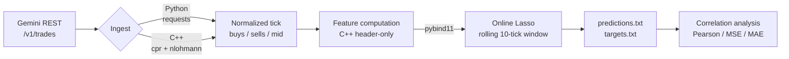

# BTC-USD Trading Research Pipeline

[](https://github.com/SomeGuy966/btc-trading-pipeline/actions/workflows/pytest.yml)
[](https://github.com/SomeGuy966/btc-trading-pipeline/actions/workflows/ruffmypy.yml)
[](https://github.com/SomeGuy966/btc-trading-pipeline/actions/workflows/cpp-tests.yml)
[](https://github.com/SomeGuy966/btc-trading-pipeline/actions/workflows/clang-format-tidy.yml)

A hybrid **C++/Python** pipeline that ingests live trade data from the Gemini exchange, computes
order-flow features in C++, runs online Lasso regression to predict short-horizon midprice returns,
and scores those predictions against realized returns.

This is a **research pipeline**: it produces and evaluates predictions. It does not place orders.

---

## Architecture



The C++ layer is compiled into a pybind11 extension module that the Python orchestration layer
imports directly — there is no serialization boundary or IPC between them.

---

## How it works

### 1 — Ingest

Two interchangeable implementations behind the same interface:

| Implementation | Stack |
| --- | --- |
| Python | `requests` against Gemini's `/v1/trades` REST endpoint |
| C++ | `cpr` + `nlohmann/json`, exposed to Python via pybind11 |

Each poll returns recent trades split into buy and sell sides. Midprice is approximated as the
mean of the highest buy price and the lowest sell price observed in the window.

### 2 — Features (C++)

Header-only classes implementing a shared `BaseFeature` interface. A tick is a vector of
`(price, notional, is_buy)` tuples:

| Feature | Description |
| --- | --- |
| `FeatureCountTrades` | Number of trades in the tick |
| `FeatureRatioBuys` | Share of trades on the buy side |
| `FeatureRatioSells` | Share of trades on the sell side |
| `FeatureVolumeWindow` | Summed notional over a rolling 5-tick window |

### 3 — Inference

Online Lasso over a rolling window of 10 ticks, refit on **every** tick.

Two details that are easy to get wrong and are handled explicitly:

- **Train/predict lag.** At time `t`, realized targets only exist through `t-1`. The model
  therefore trains on features from `t-10 … t-1` and predicts on the features at `t`.
- **Standardization scope.** Feature means and standard deviations are computed on the training
  window only, then applied to the prediction row — never fit on data that includes the row
  being predicted.

### 4 — Analysis

Predicted and realized returns are logged per tick. `evaluate_predictions.py` reports Pearson
correlation, MSE, and MAE over the aligned series.

---

## Quickstart

**Prerequisites:** Python 3.12 (with development headers), CMake, Ninja, GNU Make,
[Poetry](https://python-poetry.org/), [Conan](https://conan.io/), and a C++20 compiler.

```bash
make install     # conan install + poetry install
make build       # cmake configure + build the pybind module
make test        # C++ GoogleTest suite + pytest
make run-main    # live loop against Gemini (polls every 10s)
make analyze     # correlation report over logged predictions
```

---

## Testing

**72 tests** — 43 `pytest`, 29 GoogleTest, all green in CI.

- Unit tests mock the HTTP layer with `MagicMock`, so the suite runs offline and deterministically
- The live-endpoint integration test validating Gemini's response schema is env-gated, keeping CI
  hermetic rather than dependent on a third-party service being reachable
- C++ tests cover feature edge cases: empty ticks, single-sided flow, and rolling-window rollover

```bash
make test                          # unit suites (C++ and Python)
RUN_INTEGRATION=1 poetry run pytest src/pysrc/test/slower_tests   # live-endpoint test
```

## Continuous integration

Four GitHub Actions workflows gate every pull request:

| Workflow | Checks |
| --- | --- |
| `pytest.yml` | Python unit tests |
| `ruffmypy.yml` | `ruff` lint + format, `mypy` strict type checking |
| `cpp-tests.yml` | GoogleTest C++ unit tests |
| `clang-format-tidy.yml` | `clang-format` + `clang-tidy` |

The Python package ships `py.typed` and passes `mypy` in strict mode.

---

## Layout

```
src/
├── cppsrc/                     # header-only C++ core
│   ├── base_feature.hpp        # abstract feature interface
│   ├── feature_*.hpp           # feature implementations
│   ├── data_client.hpp         # C++ REST ingest (cpr + nlohmann/json)
│   ├── main.cpp                # pybind11 module definition
│   └── test/                   # GoogleTest suites
└── pysrc/                      # Python orchestration
    ├── data_client.py          # Python REST ingest
    ├── model.py                # online Lasso wrapper
    ├── main.py                 # live tick loop
    ├── evaluate_predictions.py # correlation / MSE / MAE report
    └── test/                   # pytest suites
```

**Build:** CMake + Conan + Ninja for C++, Poetry for Python, orchestrated by a single Makefile.

---

## Design notes

**Why header-only C++.** Every feature lives entirely in a header, with `.cpp` files reserved for
tests and the pybind module definition. This trades compile time for a simpler build graph and
easier inlining across translation units — a reasonable trade at this scale.

**Why port ingest to C++.** The Python and C++ clients sit behind the same pybind interface, so
the orchestration layer is unchanged by the swap. This makes the two paths directly comparable and
keeps the option of moving more of the hot path across the boundary.

**Why online learning.** Market relationships are non-stationary. Refitting on a short rolling
window each tick adapts to regime changes, at the cost of higher variance in the fitted
coefficients — which is part of why Lasso's L1 penalty is a reasonable choice here.

## Limitations and next steps

Stated plainly, because they matter for interpreting any results:

- **REST polling, not WebSocket.** A 10-second poll interval means the feature set reflects
  coarse snapshots rather than true tick-level order flow.
- **Trade-derived midprice.** Without order book data, the midprice proxy is noisier than a true
  bid/ask mid.
- **Four features, linear model.** This is a baseline, not a competitive signal.
- **No execution modeling.** Predictions are scored on correlation with realized returns; there is
  no fill, fee, or slippage model, so these numbers are not a proxy for P&L.
